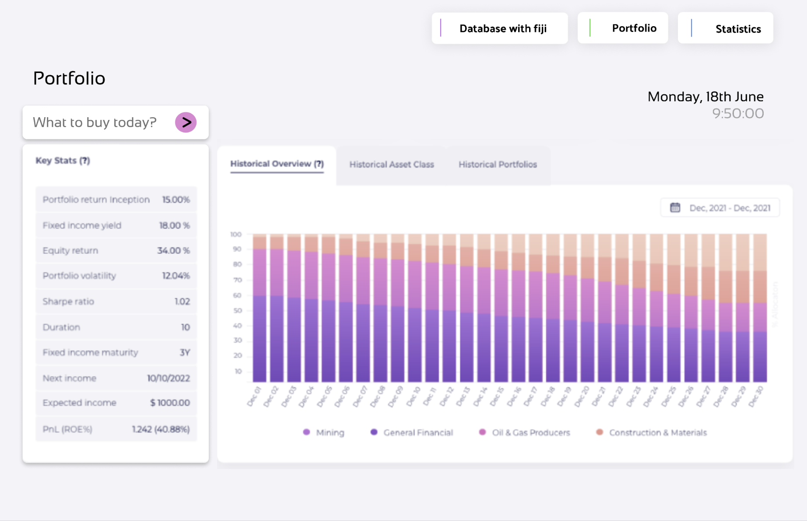

# Invest Manager Desktop Application

InvestManager is a comprehensive desktop application which is designed to help investors of all levels with the tools and insights they may need to navigate the world of financial markets. Built upon the robust foundation of C++, leveraging the Tinkoff Invest API for seamless market access, and adorned with an intuitive Qt-based user interface, InvestManager offers a streamlined and efficient approach to managing your investment portfolio.

### Features:

1) Portfolio management: 
    * Effortlessly track and manage your shares and bonds in a centralized location. 
    * Analyze historical data and visualize trends to inform your investment decisions.
2) Market exploration:
    * Access comprehensive market data and historical charts.
    * Explore and discover new investment opportunities through advanced search and filtering.
3) Investment advisor:
    * Leverage the power of algorithms and statistical models to receive personalized investment recommendations. 
4) User-Friendly Interface:
    * Navigate effortlessly through the application with a clean and intuitive Qt-based interface.
    * Customize dashboards and views to suit your preferences and workflow.

### Technologies:

* C++: Ensuring high performance and efficiency.
* Tinkoff Invest API: Providing secure and reliable access to market data and trading functionality.
* Qt: Delivering a modern and user-friendly interface.

# Detailed Overview ==============

## Homepage

### Functionality:
1) The list of all shares and bonds that are available on the market
2) Filters: quantity, price, current value, capital gain/loss
3) buttons BUY and SELL (still in question)
4) List of all favourite shares and bonds, and the possibility to add/delete items from the list

## Information about particular share

### Functionality:
1) Graph represents historical data about the price of a particular share
2) Possibility to choose period and adjust different parameters with filters
3) Possibility to compare data about two shares by adding another one to the graph

## Statistics

### Functionality:
1) Information about top-gainers and top-losers of a particular period
2) Information about the most actively bought and sold shares

## Portfolio

### Functionality:
1) Information about the portfolio of a user
2) Possibility to see the recommendations to buy/sell shares (advices are given based on our algorithms, statistics and historical data)
